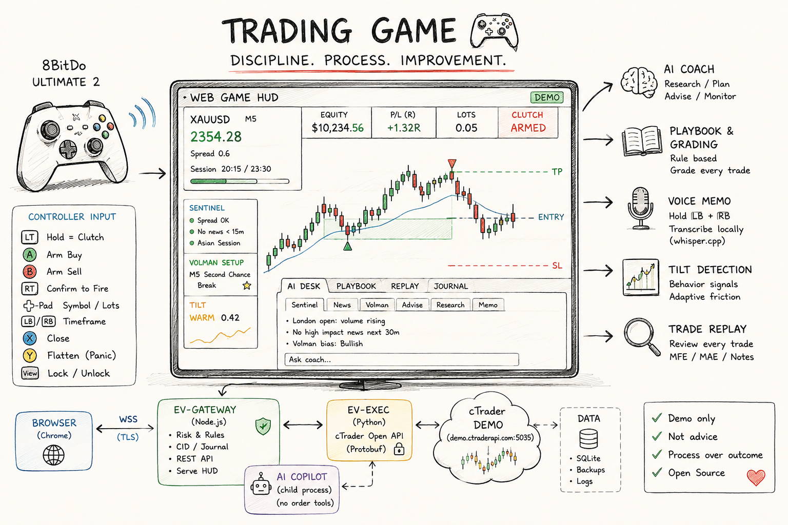
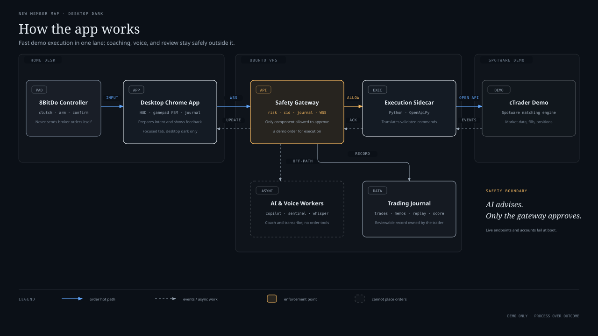

# Evening Forex Gold Gamepad

<p align="center">
  
</p>

<p align="center">
  <a href="#test-suite"></a>
  <a href="#architecture"></a>
  <a href="#locked-decisions"></a>
  <a href="#locked-decisions"></a>
  <a href="#controller-map"></a>
  <a href="#locked-decisions"></a>
  <a href="#safety-invariants"></a>
</p>

---

## Overview

A desktop Chrome **web game** — an installable, client-side **React PWA** — where an **8BitDo Ultimate 2 Wireless** controller trades forex and gold on a **cTrader demo account**. The pad communicates over WebSocket to a **Python gateway**. Production splits the origins: the HUD is a static site on **Vercel (Hobby/free)**, the gateway is Docker on your **local machine or Ubuntu VPS** at `https://gw.bobvolman.com`. There is no execution sidecar and no secondary microservice. A near-realtime **AI desk** coaches from the sidelines without touching the order path.

On top of the game sits a **trading journal** that takes the best of Edgewonk and TradeZella and rebuilds them for gamepad interaction:
- **Playbook:** grades every fire against its own rules *before* you commit.
- **Voice memo:** captures trade rationale hands-free when you cannot type while trading.
- **Trade replay:** scrubs closed trades back through the 1 Hz tape using gamepad analog sticks.
- **Tilt-meter:** derives emotional arousal directly from pad telemetry and interaction pace.
- **Process-weighted score:** rates the evening on decision quality rather than financial outcome.
- **Daily cockpit:** covers the entire daily trading loop — readiness checklists, multi-market clocks, position sizing, execution review (Actual vs Plan), reports, encrypted backup, restore, and audit wipe.

> [!IMPORTANT]
> **The end goal is confidence and enjoyment — improving decision quality, not the money.**  
> Demo only. Not financial advice. Entertainment and discipline, not alpha.

---

## Project Status

**Current State:** Phases **1–4, 6, 7, 9, 10, 11, 12, and 13** are **built and fully covered by 756 tests** (542 Python pytest + 214 TypeScript vitest).

- **Backend Gateway:** Single-process FastAPI + WebSocket gateway with frozen v1 envelope, SQLite migrations `001`–`010`, risk engine with atomic CID reservations, position limits, dead-man switch, and native `ctrader-open-api` integration with request timeout resilience and fire-and-forget execution.
- **Web Arcade Frontend:** React 18 PWA (`evgamepad-arcade`) with 20+ responsive screens, collapsible navigation rail, lightweight-charts candlestick integration, interactive HUD, GameOverlay modal, and full offline service worker caching.
- **Terminology Refactored:** Clean, consistent **BUY / SELL** terminology unified across the entire stack (protocol catalog, database schema, risk engine, frontend components).
- **Discipline & Journaling:** Complete implementation of pre-commit playbook grading, 5-axis Process Score radar (where standing down in a dead tape scores 100), measured behavioral tilt telemetry with open-friction gates, 1 Hz dual-book tape replay, printable browser PDF reports, streamed CSV/JSON exports, and encrypted SQLite snapshot backup/restore lifecycle.

**Remaining Roadmap:**
- **Phase 5 (Ubuntu Docker Deploy):** Documented below — nginx + Docker Compose on an Ubuntu VPS, gateway at `gw.bobvolman.com`.
- **Phase 8 (Voice Memo Local STT):** Local `whisper.cpp` container speech-to-text pipeline (deferred).
- **Phase 14 (Release Gate):** End-to-end integration and smoke verification on physical 8BitDo hardware and live IC Markets demo accounts.

Detailed authority: [`plans/260824-1506-evening-forex-gold-gamepad/plan.md`](./plans/260824-1506-evening-forex-gold-gamepad/plan.md).

---

## Table of Contents

- [Controller Map & Safety](#controller-map)
- [Architecture](#architecture)
- [Safety Invariants](#safety-invariants)
- [Feature Layers](#feature-layers)
- [Locked Technical Decisions](#locked-decisions)
- [Phases & Roadmap](#phases)
- [Repo Layout](#repo-layout)
- [Getting Started](#getting-started)
  - [Prerequisites](#prerequisites)
  - [Recommended production shape](#recommended-production-shape)
  - [cTrader Open API registration](#ctrader-open-api-registration)
  - [Local Development](#local-development)
  - [Testing & Quality Assurance](#test-suite)
  - [Deploy the HUD on Vercel (free)](#deploy-the-hud-on-vercel-free)
  - [Run the gateway with Docker](#run-the-gateway-with-docker)
    - [On your local machine](#on-your-local-machine)
    - [On an Ubuntu VPS](#on-an-ubuntu-vps-gwbobvolmancom)
  - [First evening and operations](#first-evening-and-operations)
  - [Protocol & Type Synchronization](#protocol-types-are-generated-never-hand-written)
- [Playbooks: Enforced vs Graded](#playbooks-enforced-vs-graded)
- [The Performance Deck](#the-deck-and-what-it-refuses-to-show)
- [The Daily Journal Cockpit](#the-daily-journal)
- [Process Score & Radar](#the-process-score)
- [Trade Replay](#trade-replay)
- [Tilt Detection & Telemetry](#tilt-what-it-measures-and-what-it-cannot-do)
- [Settings, Reports & Data Ownership](#settings-reports-and-your-data)
- [Non-Goals](#non-goals)
- [Documentation](#documentation)

---

## Controller Map

| Input | Action |
|---|---|
| `LT` (hold) | Clutch — nothing fires without it |
| `A` | Arm **BUY** |
| `B` | Arm **SELL** |
| `RT` | Confirm to fire |
| D-pad | Symbol / lot size |
| `LB` / `RB` | Timeframe |
| `LB + RB` (hold) | Push-to-talk voice memo |
| `X` | Close active position |
| `Y` | Flatten (panic) |
| `View` | Lock / unlock session |
| `Menu` | Open / close the safe GameOverlay; opening cancels ARM and locks new opens |

Inside **GameOverlay**, D-pad selects a destination, `LB/RB` changes desk tabs, `A` enters/applies a safe preference, `B` goes back, and `Menu` exits. Playbook, Journal, System, Reports, and Settings all adhere to this single navigation contract. Navigation cannot emit open/modify orders. An SL/TP edit only stages a modify preview; `LT+RT` is still required before it reaches cTrader. Dedicated close and panic controls remain available as safety exits.

### Pairing the 8BitDo Ultimate 2 Wireless

1. Set the switch on the back to **X** (XInput). Chrome reports `mapping: "standard"`, ensuring direct button mapping without custom calibration.
2. Plug the **2.4G dongle** into the Mac and press **Start** (the primary supported link).
3. Wired USB-C is the verified fallback; use it if the wireless dongle encounters interference.
4. Open the HUD, focus the tab, and **press any button** — the Gamepad API stays silent until an initial user gesture occurs (browser privacy spec). The HUD reports `pad: absent` until pressed.
5. Back paddles (`L4`/`R4`) are activated only if an initial probe detects movement; otherwise, the game operates on `LT`/`RT` without degradation.

> [!CAUTION]
> **The browser tab must stay focused.** Hiding the tab or unplugging the controller immediately cancels any active ARM and locks new open orders at both ends: the client stops transmitting, and the gateway dead-man rejects execution. Close, panic, and the HUD's **FLATTEN** button continue to function regardless.

---

## Architecture



[Open the standalone interactive diagram](./docs/how-the-app-works.html).

The **gateway is the sole component authorized to approve and route demo orders**. The controller and the React PWA prepare user intent; the Python gateway validates risk and translates approved intents into cTrader Open API Protobuf messages over its internal `ctrader-open-api` connection. Spotware operates as the matching engine.

```
Order Hot Path:
  [8BitDo Controller] ──> [Focused Chrome PWA] ──(WSS to gw.bobvolman.com)──> [Gateway Risk Gates] ──(Protobuf)──> [cTrader Demo API]

Broker Return Path:
  [cTrader Demo API] ──(Execution Events / Quotes)──> [Python Gateway] ──(WSS)──> [React HUD & Controller Rumble]

Sidecar Learning Path:
  [TradingView / Sentinel] ──> [AI Copilot Worker] ──> [Advisory / Voice / Tape / Journal SQLite] (Read-Only)
```

1. **Order hot path:** controller → focused Chrome tab → gateway risk checks → in-process cTrader Open API connection → cTrader demo.
2. **Broker return path:** market data, fills, positions, and execution events flow back through the gateway to update the HUD and trigger controller vibration.
3. **Learning path:** AI coaching, voice transcription, journal persistence, tape replay, and Process Score calculation run alongside the order path without blocking execution.

### Latency Budget (Honest)

| Segment | Target | Notes |
|---|---|---|
| Pad poll → intent | < 16 ms | 60 Hz Gamepad API polling loop |
| Home → VPS WS | 15–80 ms | Dominant segment (network transport) |
| Gateway risk gates | < 5 ms | In-memory CID check, position caps, R limits |
| VPS → Spotware demo ack | 20–80 ms | Protobuf TCP/SSL session to `demo.ctraderapi.com:5035` |
| AI advisory | 1–5 s | Cold path; never blocks order execution |

---

## Safety Invariants

Enforced through **hard boot-fails in configuration**, not conventions. The gateway process exits immediately if any invariant is violated:

- `mode: live` or connection to a live Open API host → **Refuse to start (exit non-zero)**.
- `copilot.on_hot_path: true` → **Refuse to start**. AI tools are read-only and strictly isolated from the order path.
- `voice.stt.mode` outside `{local, off}` → **Refuse to start**. No external cloud speech transcription.
- `voice.bindings` resolving to `LT/RT/A/B/X/Y` → **Refuse to start**. Voice is restricted to memos and advisory questions.
- `tilt.gate_close: true` → **Refuse to start**. Tilt may add friction to *opens* only; close and panic always execute.
- `score.weights` not summing to 1.0 → **Refuse to start**.
- `tradingview.auto_trade: true` → **Refuse to start**. External signals are informational only.

---

## Feature Layers

| Layer | What It Does |
|---|---|
| **AI Desk** | Sentinel (spread, news events, market session clocks), Volman M5 price action setups, research, plan, and real-time coaching. Restricted to read-only tools. |
| **Playbook & Grading** | Every trade is graded against its specific setup rules, with the rule validation count displayed in the ARM overlay *before* commit. |
| **Voice Memo** | Hold `LB + RB` push-to-talk; records trade rationale and persists locally with audio playback in replay. |
| **Tilt Detection** | 1 Hz controller telemetry (clutch cycles, arm flips, button rates, lot scaling) drives adaptive friction on opens. Never affects exits. |
| **Trade Replay** | Scrub frozen 1 Hz dual-book tapes with analog sticks; inspect entry, exit, MAE/MFE excursions, and associated voice memos. |
| **Process Score** | 5 process-only dimensions (adherence, selectivity, risk discipline, preparation, review). Correctly standing down scores a perfect 100. |
| **Daily Journal Cockpit** | Multi-timezone IANA market clocks, 5-item readiness check, pre-session analysis, lot sizing calculator, Process Score heatmap, and filterable trade history. |
| **Execution Learning** | Actual vs Plan review, planned vs impulsive classification, mistake taxonomy, and trader principles linkage. |
| **Data Portability** | Print-friendly CSS reports (browser PDF), streamed CSV/JSON exports, and SHA-256 validated SQLite backup, restore, and nuclear wipe. |

---

## Locked Decisions

| Area | Decision | Details |
|---|---|---|
| **Execution** | cTrader Open API | In-process Protobuf via `ctrader-open-api`, `demo.ctraderapi.com:5035` |
| **Broker** | IC Markets cTrader Demo | Standard symbols (`XAUUSD`, `EURUSD`, `GBPUSD`, `USDJPY`), max 0.10 lot gold |
| **Host** | HUD on Vercel Hobby; gateway in Docker | Static `app/` on Vercel (free). One container (`ev-gateway`) on a laptop or Ubuntu VPS; nginx terminates TLS at `gw.bobvolman.com` |
| **Account Mode** | Demo Only | Hard boot-fail on live endpoints or production accounts |
| **Session Window** | `Asia/Ho_Chi_Minh` | 18:00–23:30 evening trading session |
| **Transport** | WebSocket (`/ws`) + REST (`/api/*`) | Envelope: `{v, t, seq, ts, ch, cid, p}`. HUD may be a separate origin; gateway CORS + Origin allowlist |
| **Frontend Stack** | React 18 PWA | TypeScript, Vite, Lightweight Charts, dark arcade theme. Production build sets `VITE_GATEWAY_ORIGIN=https://gw.bobvolman.com` |
| **Backend Stack** | Python 3.11+ | FastAPI, Uvicorn, Pydantic v2, Twisted/OpenApiPy, SQLite |
| **Database** | SQLite + Migrations | Phase migrations `001`–`010` stored in `/data/journal.db` |

---

## Phases

```text
1 → 2 → 3 → 4 → [5] → 6 → 7 → [8] → 9 → 10 → 11 → 12 → 13 → [14]
```

| # | Phase | Scope | Status |
|---|---|---|---|
| 1 | [Repo, protocol, Docker config](./plans/260824-1506-evening-forex-gold-gamepad/phase-01-repo-protocol-docker-config.md) | Protocol v1, config boot-fails, migrations runner | **Built & Verified** |
| 2 | [cTrader exec and socket gateway](./plans/260824-1506-evening-forex-gold-gamepad/phase-02-ctrader-exec-and-socket-gateway.md) | cTrader client, risk gates, cid ledger, tape pipeline | **Built & Verified** |
| 3 | [Web game and 8BitDo client agent](./plans/260824-1506-evening-forex-gold-gamepad/phase-03-web-game-and-8bitdo-client-agent.md) | Gamepad FSM agent, chord detection, PWA shell | **Built & Verified** |
| 4 | [AI desk: sentinel, news, Volman](./plans/260824-1506-evening-forex-gold-gamepad/phase-04-ai-desk-sentinel-news-volman.md) | Opportunity quality, Volman detectors, advisory tools | **Built & Verified** |
| 5 | [Ubuntu Docker deploy](./plans/260824-1506-evening-forex-gold-gamepad/phase-05-ubuntu-docker-deploy.md) | Single-service compose, nginx TLS reverse-proxy to `gw.bobvolman.com` | **Documented** (see [Run the gateway with Docker](#run-the-gateway-with-docker)) |
| 6 | [Performance and psychology deck](./plans/260824-1506-evening-forex-gold-gamepad/phase-06-performance-and-psychology-deck.md) | Process deck, adherence, month-over-month trends | **Built & Verified** |
| 7 | [Playbook and trade grading](./plans/260824-1506-evening-forex-gold-gamepad/phase-07-playbook-and-trade-grading.md) | Rule registry, setups, pre-commit rule grading | **Built & Verified** |
| 8 | [Voice: capture, whisper.cpp, coach](./plans/260824-1506-evening-forex-gold-gamepad/phase-08-voice-capture-whisper-and-coach.md) | Audio upload, local whisper.cpp STT, coach TTS | *Deferred* |
| 9 | [Tilt telemetry and adaptive friction](./plans/260824-1506-evening-forex-gold-gamepad/phase-09-tilt-telemetry-and-adaptive-friction.md) | Behavioral pad telemetry, open friction, cooldown | **Built & Verified** |
| 10 | [Trade replay](./plans/260824-1506-evening-forex-gold-gamepad/phase-10-trade-replay.md) | 1 Hz dual-book tape freeze, gamepad stick scrubbing | **Built & Verified** |
| 11 | [Process Score and radar deck](./plans/260824-1506-evening-forex-gold-gamepad/phase-11-process-score-and-radar-deck.md) | 5 process axes, vacuous axes normalization, radar | **Built & Verified** |
| 12 | [Daily journal cockpit](./plans/260824-1506-evening-forex-gold-gamepad/phase-12-daily-journal-cockpit-and-preparation.md) | Market clocks, readiness, sizing, Actual vs Plan | **Built & Verified** |
| 13 | [Reports, settings, and data portability](./plans/260824-1506-evening-forex-gold-gamepad/phase-13-reports-settings-and-data-portability.md) | Printable PDF reports, exports, backup, restore, wipe | **Built & Verified** |
| 14 | [End-to-end release gate](./plans/260824-1506-evening-forex-gold-gamepad/phase-14-end-to-end-session-journey-and-release-gate.md) | Full demo session on physical pad and VPS broker | *Pending* |

---

## Repo Layout

```text
evgamepad/
├── app/                        # React 18 Arcade PWA (Vite, TypeScript, Tailwind)
│   ├── src/
│   │   ├── components/         # Reusable arcade UI widgets & layout primitives
│   │   ├── screens/            # 20+ specialized screens (Live HUD, Journal, Replay, etc.)
│   │   ├── pad/                # 8BitDo gamepad driver, chord detection, FSM, telemetry
│   │   ├── net/                # WebSocket client, reconnection, message routing
│   │   ├── journal/            # Journal cockpit, readiness checklists, trade review
│   │   ├── replay/             # 1 Hz dual-book tape scrubber and chart components
│   │   ├── deck/               # Process performance metrics, Process Score radar
│   │   ├── protocol/           # Auto-generated schema.json and types.ts
│   │   └── sw.ts               # Offline PWA service worker implementation
│   └── scripts/                # check-protocol-types.mjs (catches contract drift)
│
├── apps/
│   └── gateway/                # Single-process Python 3.11 gateway (FastAPI)
│       ├── api/                # WebSocket `/ws`, REST endpoints, static HUD serving
│       ├── broker/             # cTrader Open API client (Protobuf TCP/SSL, events, timeouts)
│       ├── copilot/            # AI desk background worker (read-only advisory tools)
│       ├── data/               # SQLite backup snapshots, restore verification, wipe
│       ├── db/                 # SQLite migrations runner and migrations 001–010
│       ├── deck/               # Process adherence and performance metric calculators
│       ├── grading/            # Playbook pre-commit trade grading engine
│       ├── journal/            # Journal queries, review attachments, tape freezing
│       ├── method/             # Unified rule registry (risk rules + playbook setups)
│       ├── protocol/           # Frozen v1 envelope & Pydantic catalog (single source of truth)
│       ├── replay/             # 1 Hz dual-book tape aggregations & scrub endpoints
│       ├── reports/            # Printable PDF report queries and data formatting
│       ├── risk/               # Risk engine: CID reservations, limits, dead-man switch
│       ├── score/              # 5-axis Process Score radar engine
│       ├── sentinel/           # Market sentinel: spread, session clocks, opportunity quality
│       ├── settings/           # Safe user preferences schema & reflection
│       ├── signals/            # Economic calendar and external signal intake
│       └── tilt/               # Measured behavioral tilt telemetry & friction gates
│
├── config/
│   └── default.yaml            # Single configuration source of truth
├── deploy/                     # nginx vhosts for gw.bobvolman.com, VPS runbook, model fetch
├── docs/                       # Architecture diagrams, specifications, BA artifacts
└── plans/                      # Phase implementation specifications, journals, research
```

---

## Getting Started

### Prerequisites

- **Python:** 3.11+ with [`uv`](https://github.com/astral-sh/uv) package manager.
- **Node.js:** v20+ (v22 recommended) for building the web bundle.
- **Hardware:** Desktop Chrome browser and an **8BitDo Ultimate 2 Wireless** controller with 2.4G USB dongle.
- **Broker Account:** A free **cTrader ID** with an **IC Markets cTrader Demo** account and an approved **Open API** application (see below).
- **Container Runtime:** Docker & Docker Compose to run the gateway on your laptop or a VPS.
- **HUD hosting (production):** A free [Vercel](https://vercel.com) Hobby account, or any static host.

### Recommended production shape

```text
Chrome  ──HTTPS──►  Vercel Hobby (free)     React HUD  (*.vercel.app or your domain)
                         │
                         │  fetch /api/*   and   wss://gw.bobvolman.com/ws
                         ▼
              Docker on your VPS or laptop
              nginx :443  →  127.0.0.1:8444  ev-gateway
                         │
                         ▼
              demo.ctraderapi.com:5035   (cTrader Open API, demo only)
```

| Piece | Where it runs | Public URL |
|---|---|---|
| **HUD** | Vercel Hobby (static `app/dist`) | `https://your-project.vercel.app` (or a custom domain) |
| **Gateway** | Docker Compose on a laptop or Ubuntu VPS | `https://gw.bobvolman.com` (VPS + nginx) or `http://127.0.0.1:8444` (local only) |
| **Broker** | Spotware cloud | `demo.ctraderapi.com:5035` — never live |

The session token is pasted into the HUD at connect time. It is never written into the Vercel bundle. cTrader client id, secret, and tokens live only in the gateway `.env`.

A `https://*.vercel.app` page **cannot** call `http://127.0.0.1:8444` (mixed content). Everyday play is **Vercel HUD + VPS gateway**. Local work is **`npm run dev` + gateway on localhost**.

### cTrader Open API registration

The gateway speaks Spotware's **cTrader Open API** (Protobuf TCP on port 5035). There is no in-app OAuth helper in v1: you register once, consent once in a browser, and paste the tokens into `.env`. After that the gateway refreshes them itself.

Official docs: [register an application](https://help.ctrader.com/open-api/api-application/), [app and account authentication](https://help.ctrader.com/open-api/account-authentication/).

#### 1. cTrader ID

1. Open [id.ctrader.com](https://id.ctrader.com) and create a **cTrader ID** (email + password, or the cTrader ID signup from any cTrader platform).
2. Confirm the email. This ID is the identity that owns demo accounts and Open API apps.

#### 2. IC Markets cTrader demo account

1. Open an **IC Markets** account and choose **cTrader** as the platform, **demo** (not live).
2. Complete their demo signup so an IC Markets **cTrader demo** account is linked to the same cTrader ID.
3. Log in once with the cTrader desktop or web terminal and confirm you can see **XAUUSD**, **EURUSD**, **GBPUSD**, and **USDJPY** with no broker suffix.
4. Note the account number shown in the platform. The Open API id (`ctidTraderAccountId`) is often the same number; confirm it in step 6.

Live accounts are refused at gateway boot. Do not use a live Open API host or a live `ctidTraderAccountId`.

#### 3. Register the Open API application

1. Open the [cTrader Open API portal](https://openapi.ctrader.com/apps) (Spotware). Log in with the **same cTrader ID**.
2. Click **Add new app**.
3. Fill **Application name** (for example `Evening Forex Gold Gamepad`) and a **detailed description**. Spotware reviews this; a vague one-liner delays approval. Say it is a **personal demo-only gamepad HUD** that places demo MARKET orders through the Open API and never handles live money.
4. Save. Status is **Submitted**. Wait for the email that it is **Active**. Credentials do not work while it is submitted.
5. After approval, open the app → **Edit**. Under **Redirect URIs**, add one URI you control. For this one-person setup use:

   ```text
   https://localhost
   ```

   Do **not** use the portal's default Playground redirect URI in the steps below — that URI only works inside the Playground.

6. Open **Credentials** and copy **Client ID** and **Client Secret**. These become `CT_CLIENT_ID` and `CT_CLIENT_SECRET`.

#### 4. Fast path: Playground token (your own cTID)

If you are the only trader (this product is one demo account), the portal Playground is enough:

1. Applications → your app → **Playground**.
2. Scope **trading** (not `accounts` — view-only cannot place orders).
3. **Get token**. Copy `accessToken` and `refreshToken`.

Skip to step 6. Use the full OAuth flow below if you want a redirect-URI grant instead of the Playground.

#### 5. Full path: browser consent + token exchange

The authorisation code lasts **one minute**. Have a terminal ready before you click Allow.

1. URL-encode the redirect URI. For `https://localhost` that is `https%3A%2F%2Flocalhost`.
2. Open this in Chrome (replace `YOUR_CLIENT_ID`):

   ```text
   https://id.ctrader.com/my/settings/openapi/grantingaccess/?client_id=YOUR_CLIENT_ID&redirect_uri=https%3A%2F%2Flocalhost&scope=trading&product=web
   ```

3. Sign in with the cTrader ID. Allow access to the **IC Markets demo** account (not a live one).
4. Chrome lands on `https://localhost/?code=...` (the page itself may fail to load — that is expected). Copy the `code` query value from the address bar immediately.
5. Exchange it before it expires (replace the placeholders; `redirect_uri` must match the registered URI **exactly**, including `https`):

   ```bash
   curl -sS -G 'https://openapi.ctrader.com/apps/token' \
     --data-urlencode 'grant_type=authorization_code' \
     --data-urlencode 'code=PASTE_CODE_HERE' \
     --data-urlencode 'redirect_uri=https://localhost' \
     --data-urlencode 'client_id=YOUR_CLIENT_ID' \
     --data-urlencode 'client_secret=YOUR_CLIENT_SECRET'
   ```

6. The JSON body contains `accessToken` and `refreshToken`. The refresh token does not expire; the access token lasts about 30 days and the gateway refreshes it from then on.

`scope=accounts` is view-only and will not trade. Always use `trading`.

#### 6. Demo account id (`CT_ACCOUNT_ID`)

`CT_ACCOUNT_ID` is the Open API **`ctidTraderAccountId`** (an integer), not the cTrader ID email.

Ways to read it:

- Open API portal Playground: after you have a token, send `ProtoOAGetAccountListByAccessTokenReq` and copy `ctidTraderAccountId` for the IC Markets **demo** row (`isLive` must be false).
- The grant screen in step 5 lists the accounts you allowed; use the demo id.
- IC Markets cTrader often shows the same number as the account login.

If you paste a live account id, the gateway exits on boot.

#### 7. Write `.env`

From the repo root:

```bash
cp .env.example .env
chmod 600 .env
```

```dotenv
CT_CLIENT_ID=from_the_portal_credentials
CT_CLIENT_SECRET=from_the_portal_credentials
CT_ACCESS_TOKEN=from_playground_or_curl
CT_REFRESH_TOKEN=from_playground_or_curl
CT_ACCOUNT_ID=12345678
EV_WS_TOKEN=  # openssl rand -hex 32

# Browser Origin of the HUD (Chrome's address bar, no trailing slash).
# Local Vite: http://localhost:5173
# Vercel:     https://your-project.vercel.app
EV_PUBLIC_ORIGIN=http://localhost:5173
```

Treat `CT_*` and `EV_WS_TOKEN` like passwords. They never go into Vercel env, git, or the HUD.

What each cTrader field is:

| `.env` | Where it comes from | Used for |
|---|---|---|
| `CT_CLIENT_ID` | App → Credentials | `ProtoOAApplicationAuthReq` |
| `CT_CLIENT_SECRET` | App → Credentials | Same app auth. Rotate in the portal if it leaks. |
| `CT_ACCESS_TOKEN` | Playground **Get token**, or the curl in step 5 | `ProtoOAAccountAuthReq`. Lasts about 30 days. |
| `CT_REFRESH_TOKEN` | Same response as the access token | Gateway refreshes the access token. Does not expire unless you revoke the app. |
| `CT_ACCOUNT_ID` | `ctidTraderAccountId` integer | Must be the **demo** row (`isLive: false`). |

Older Spotware docs say [connect.spotware.com](https://connect.spotware.com). That portal is the same Open API program; the current apps list is [openapi.ctrader.com/apps](https://openapi.ctrader.com/apps).

#### 8. If tokens stop working

Refresh without another browser consent (replace placeholders):

```bash
curl -sS -G 'https://openapi.ctrader.com/apps/token' \
  --data-urlencode 'grant_type=refresh_token' \
  --data-urlencode 'refresh_token=YOUR_REFRESH_TOKEN' \
  --data-urlencode 'client_id=YOUR_CLIENT_ID' \
  --data-urlencode 'client_secret=YOUR_CLIENT_SECRET'
```

Paste the new `accessToken` (and `refreshToken` if the JSON includes a new one) into `.env`, then `docker compose up -d` or restart the `uv` process.

| Symptom | Fix |
|---|---|
| App status **Submitted** | Wait for the approval email. Tokens fail until **Active**. |
| `redirect_uri mismatch` | The curl `redirect_uri` must match the URI saved on the app **exactly** (including `https`). Do not use the Playground default URI in curl. |
| `invalid_grant` / empty `code` | The authorisation code lasted ~60s. Repeat step 5 with the terminal already open. |
| Orders rejected / view-only | You granted `scope=accounts`. Repeat with `scope=trading`. |
| Gateway exits: account is LIVE | `CT_ACCOUNT_ID` is a live account. Pick the demo `ctidTraderAccountId`. |
| Gateway exits: missing env | `.env` is incomplete or not loaded. Compose uses the repo-root `.env`. |
| `account is not on this access token` | The token was issued for a different cTrader ID, or you did not Allow that demo account. |

Official references: [register an application](https://help.ctrader.com/open-api/api-application/), [app and account authentication](https://help.ctrader.com/open-api/account-authentication/), [endpoints](https://help.ctrader.com/open-api/proxies-endpoints/) (`demo.ctraderapi.com:5035` only).

### Local Development

#### 1. Backend Gateway

```bash
cd apps/gateway
uv sync --group dev
EV_DEV=1 EV_CONFIG=../../config/default.yaml EV_DATA_DIR=../../data uv run python main.py
```
The gateway binds to `127.0.0.1:8444`. Health check:
```bash
curl -s http://127.0.0.1:8444/healthz
```

#### 2. Frontend Web App

In a separate terminal:
```bash
cd app
npm install
npm run dev
```
Open `http://localhost:5173` in Google Chrome, connect your 8BitDo controller, and press any button to begin.

For a containerized local gateway (same loopback bind, same `.env`), see [Run the gateway with Docker](#run-the-gateway-with-docker) → [On your local machine](#on-your-local-machine). Do not mix this `http://localhost:5173` HUD with a remote Vercel origin unless that origin is listed in `EV_PUBLIC_ORIGIN` / `EV_CORS_ORIGINS`.

---

### Test Suite

The project enforces high test reliability across both backend and frontend layers:

```bash
# Run backend tests (542 tests covering risk, broker, protocol, journal, replay, score)
cd apps/gateway
uv run python -m pytest

# Run frontend tests (214 tests covering gamepad FSM, chords, WebSocket, HUD, replay, gateway URL)
cd ../../app
npm test

# Run frontend type checking & protocol drift validation
npm run build
```

---

### Deploy the HUD on Vercel (free)

The HUD is a Vite static app in `app/`. A [Vercel Hobby](https://vercel.com/pricing) account is enough: HTTPS, a `*.vercel.app` URL, git deploys on every push, no credit card for this shape. Vercel does **not** run Python, Docker, SQLite, or the cTrader socket.

`app/vercel.json` is in the repo. It tells Vercel: framework Vite, output `dist`, SPA fallback to `index.html`, and `Cache-Control: no-cache` on `index.html` / `sw.js` so a new deploy is picked up.

Pick **one** HUD origin and put it on the gateway as `EV_PUBLIC_ORIGIN` after the first successful deploy.

#### GitHub import (typical)

1. Push this repo to GitHub. Sign in at [vercel.com](https://vercel.com) → Hobby.
2. **Add New… → Project** → import the GitHub repo.
3. Before the first deploy, open **Root Directory** and set it to `app` (not the repository root). If you skip this, Vercel looks for a Vite app next to `compose.yaml` and the build fails.
4. Confirm:

   | Setting | Value |
   |---|---|
   | Framework Preset | Vite |
   | Build Command | `npm run build` |
   | Output Directory | `dist` |
   | Install Command | `npm install` |
   | Node.js Version | 22.x (Project → Settings → General) |

5. **Settings → Environment Variables** → add for **Production** (and **Preview** if you will open preview URLs):

   | Name | Value | Secret? |
   |---|---|---|
   | `VITE_GATEWAY_ORIGIN` | `https://gw.bobvolman.com` | No. Hostname only. |

   Vite inlines this at **build** time. After you change it, use **Redeploy** (not only Restart). Do **not** add `CT_CLIENT_ID`, `CT_CLIENT_SECRET`, `CT_ACCESS_TOKEN`, `CT_REFRESH_TOKEN`, `CT_ACCOUNT_ID`, or `EV_WS_TOKEN` — anything `VITE_*` (and anything you paste here) is visible in the browser bundle.

6. **Deploy**. Copy the Production URL, for example `https://evgamepad.vercel.app`.
7. On the machine that runs Docker, put that origin in `.env` and recreate the container:

   ```dotenv
   EV_PUBLIC_ORIGIN=https://evgamepad.vercel.app
   # Optional: allow a specific preview deployment to open /ws
   # EV_CORS_ORIGINS=https://evgamepad-git-main-yourteam.vercel.app
   ```

   ```bash
   docker compose up -d
   ```

   `EV_PUBLIC_ORIGIN` must match Chrome's origin **exactly**: `https`, no trailing slash, no extra path. A mismatch closes the WebSocket with code `4403`. Each Vercel **preview** URL is a different origin; list those you actually use in `EV_CORS_ORIGINS`.

#### CLI instead of the dashboard

From a laptop with Node, with Root Directory effectively `app/`:

```bash
cd app
npx vercel login
npx vercel link          # pick the Hobby project, or create one
npx vercel env add VITE_GATEWAY_ORIGIN production
# paste: https://gw.bobvolman.com
npx vercel --prod
```

#### Custom domain (optional, still Hobby)

Vercel → Project → **Domains** → add `bobvolman.com` or `play.bobvolman.com`, follow the DNS instructions. Then set `EV_PUBLIC_ORIGIN=https://bobvolman.com` (or whichever hostname Chrome shows) and `docker compose up -d` again.

`app/.env.production` in git already sets `VITE_GATEWAY_ORIGIN=https://gw.bobvolman.com` for a local `npm run build`. On Vercel the environment variable wins.

#### What Vercel does not host

Python, SQLite, cTrader TCP `:5035`, nginx, `/ws`, or `/api`. Those stay in Docker. A page on `https://….vercel.app` **cannot** use `ws://127.0.0.1:8444` (mixed content). Production is **Vercel HUD + HTTPS gateway on the VPS**. Day-to-day coding stays `npm run dev` against a local gateway — you do not need Vercel for that.

| Check | Expected |
|---|---|
| Vercel deploy log | Root Directory `app`, `vite build` wrote `dist/` |
| Chrome → HUD → DevTools Network | `/api/arcade/hud` and `wss://gw.bobvolman.com/ws`, not the Vercel host |
| Gateway `.env` | `EV_PUBLIC_ORIGIN` equals the Vercel Production origin |

---

### Run the gateway with Docker

The backend is **one** Compose service, `ev-gateway`. Secrets come from the repo-root `.env`. Journal data lives in the `ev-journal` volume (`/data` in the container). Docker runs on **your machine or a VPS** — not on Vercel.

| Where you run Docker | HUD you open in Chrome | Gateway URL the HUD uses |
|---|---|---|
| **Local machine** (laptop) | `npm run dev` at `http://localhost:5173` | Vite proxy → `http://127.0.0.1:8444`. Leave `VITE_GATEWAY_ORIGIN` unset. |
| **Ubuntu VPS** | Vercel Hobby (`https://….vercel.app`) | `https://gw.bobvolman.com` (nginx TLS → loopback `:8444`) |

Do **not** mix a `https://` HUD with a loopback gateway. Chrome blocks mixed content: a Vercel page cannot call `ws://127.0.0.1:8444`. Production play is Vercel + VPS. Day-to-day coding is Vite + Docker (or `uv run`) on the same computer.

`compose.yaml` publishes **only** `127.0.0.1:8444:8444`. nginx on the VPS is what exposes 443. Never publish `8444` on `0.0.0.0`.

#### On your local machine

Use this for development, tests, and a gateway on the same computer as Chrome. You do not need a VPS or Vercel for this path.

```bash
cp .env.example .env
# fill CT_* and EV_WS_TOKEN (see Open API registration)
# local Vite origin:
# EV_PUBLIC_ORIGIN=http://localhost:5173

docker compose build
docker compose up -d
docker compose ps
curl -sS http://127.0.0.1:8444/healthz
ss -lntp | grep 8444
```

`healthz` must return `"ok": true`. On the host, `ss` must show `127.0.0.1:8444` (loopback), not a WAN bind.

In another terminal:

```bash
cd app
npm install
npm run dev
```

Chrome → `http://localhost:5173`. Vite proxies `/api` and `/ws` to the container. Leave `VITE_GATEWAY_ORIGIN` unset for this path.

```bash
docker compose logs -f --tail=200 ev-gateway
docker compose restart ev-gateway
docker compose down          # stop; keeps the ev-journal volume
```

Do not publish `8444` on `0.0.0.0`. Do not point a Vercel HUD at this loopback port.

#### On an Ubuntu VPS (`gw.bobvolman.com`)

Everyday production: Vercel HUD + this gateway behind nginx on the VPS.

##### 0. What you need

- Ubuntu 22.04 or 24.04, public IPv4, SSH.
- DNS you can edit. **A record** `gw.bobvolman.com` → the VPS.
- `.env` filled from the Open API steps. `EV_PUBLIC_ORIGIN` = the **Vercel** (or custom HUD) origin.
- Ports **22**, **80**, **443** open. **8444** stays off the WAN.

##### 1. DNS

```text
gw.bobvolman.com    A    YOUR_VPS_IPV4
```

Wait until `dig +short gw.bobvolman.com` returns that address.

##### 2. Ubuntu packages

```bash
sudo apt-get update
sudo apt-get install -y ca-certificates curl git ufw nginx
sudo install -m 0755 -d /etc/apt/keyrings
sudo curl -fsSL https://download.docker.com/linux/ubuntu/gpg -o /etc/apt/keyrings/docker.asc
sudo chmod a+r /etc/apt/keyrings/docker.asc
. /etc/os-release
echo "deb [arch=$(dpkg --print-architecture) signed-by=/etc/apt/keyrings/docker.asc] https://download.docker.com/linux/ubuntu $VERSION_CODENAME stable" \
  | sudo tee /etc/apt/sources.list.d/docker.list >/dev/null
sudo apt-get update
sudo apt-get install -y docker-ce docker-ce-cli containerd.io docker-compose-plugin
sudo usermod -aG docker "$USER"
# log out and back in so `docker` works without sudo
```

```bash
sudo ufw default deny incoming
sudo ufw default allow outgoing
sudo ufw allow OpenSSH
sudo ufw allow 80/tcp
sudo ufw allow 443/tcp
sudo ufw --force enable
sudo ufw status
```

##### 3. Clone and secrets

```bash
sudo mkdir -p /opt/evgamepad /var/www/certbot
sudo chown "$USER":"$USER" /opt/evgamepad
cd /opt/evgamepad
git clone https://github.com/YOUR_ORG/YOUR_REPO.git .
cp .env.example .env
chmod 600 .env
```

```dotenv
CT_CLIENT_ID=...
CT_CLIENT_SECRET=...
CT_ACCESS_TOKEN=...
CT_REFRESH_TOKEN=...
CT_ACCOUNT_ID=...
EV_WS_TOKEN=  # openssl rand -hex 32

# Must match the Vercel HUD origin (or your custom domain).
EV_PUBLIC_ORIGIN=https://your-project.vercel.app
# EV_CORS_ORIGINS=https://your-project-git-main-you.vercel.app
```

##### 4. Compose

```bash
cd /opt/evgamepad
docker compose build
docker compose up -d
docker compose ps
curl -sS http://127.0.0.1:8444/healthz
ss -lntp | grep 8444
```

```bash
docker compose logs -f --tail=200 ev-gateway
git pull && docker compose build && docker compose up -d
```

The journal lives in Docker volume `ev-journal` (`/data` in the container). Back it up.

Optional, once, for later whisper.cpp:

```bash
./deploy/fetch-models.sh
```

##### 5. nginx TLS for the gateway

Vhost: [`deploy/nginx/gw.bobvolman.com.conf`](./deploy/nginx/gw.bobvolman.com.conf). It proxies `/healthz`, `/api/*`, `/ws`, and `/hooks/tv` to `127.0.0.1:8444`.

```bash
sudo mkdir -p /var/www/certbot
sudo cp /opt/evgamepad/deploy/nginx/gw.bobvolman.com.conf /etc/nginx/sites-available/gw.bobvolman.com
sudo ln -sf /etc/nginx/sites-available/gw.bobvolman.com /etc/nginx/sites-enabled/gw.bobvolman.com
sudo rm -f /etc/nginx/sites-enabled/default
sudo nginx -t
sudo systemctl reload nginx
sudo apt-get install -y certbot python3-certbot-nginx
sudo certbot --nginx -d gw.bobvolman.com --agree-tos -m YOU@YOUR_DOMAIN --redirect
```

After certbot, the **443** `location /` block must still have:

- `proxy_http_version 1.1;`
- `proxy_set_header Upgrade $http_upgrade;`
- `proxy_set_header Connection $connection_upgrade;` (or `"upgrade"`)
- `proxy_read_timeout 86400s;`
- `proxy_set_header Origin $http_origin;`

```bash
sudo nginx -t && sudo systemctl reload nginx
curl -sS https://gw.bobvolman.com/healthz
```

You want `"ok": true` and a trusted certificate.

You do **not** need a second nginx vhost for the HUD if Vercel is serving it.

### First evening and operations

1. Chrome, desktop, tab focused. Open the **Vercel** HUD URL (not `gw.bobvolman.com`, unless you still serve a copy from the gateway).
2. Paste `EV_WS_TOKEN`. Connect. The socket URL should be `wss://gw.bobvolman.com/ws`.
3. DevTools → Network: `/api/arcade/hud` is `200` from `gw.bobvolman.com`, request Origin is the Vercel host, no mixed-content errors.
4. Pair the 8BitDo (XInput, 2.4G dongle). Press a button. The HUD should leave `pad: absent`.
5. `docker compose logs ev-gateway` should show the broker against **demo** (`demo.ctraderapi.com:5035`), never live.

| Symptom | Likely cause |
|---|---|
| Socket closes at once (`4403`) | `EV_PUBLIC_ORIGIN` ≠ Chrome origin (`https` vs `http`, `www`, or a `*.vercel.app` preview URL) |
| REST works, WS does not | nginx missing `Upgrade` / `Connection` |
| HUD still calls its own origin for `/api` | Vercel build missing `VITE_GATEWAY_ORIGIN` — redeploy with the env var |
| Mixed content / failed `wss` | Vercel HUD pointed at `http://` or `localhost` instead of `https://gw.bobvolman.com` |
| Gateway exits at boot | live host, live account, or missing `CT_*` — see Open API registration |

| Task | Command / note |
|---|---|
| Status | `docker compose ps` and `curl -sS https://gw.bobvolman.com/healthz` |
| Logs | `docker compose logs -f --tail=200 ev-gateway` |
| Restart after reboot | `restart: unless-stopped`; nginx is systemd |
| Renew TLS | `sudo certbot renew --dry-run` |
| Rotate the HUD token | new `EV_WS_TOKEN` in `.env`, then `docker compose up -d` |
| Redeploy HUD | push to GitHub (Vercel) or `npx vercel --prod` from `app/` |
| Data | volume `ev-journal` — include it in backups |

Do not put a CDN in front of `/ws`. Do not publish `8444` on `0.0.0.0`. Live cTrader hosts still fail boot.

---

### Protocol Types Are Generated, Never Hand-Written

The Pydantic message catalog in `apps/gateway/protocol/` is the single source of truth. TypeScript definitions and JSON schemas are generated automatically:

```bash
# Regenerate TypeScript types from backend Pydantic models
cd apps/gateway
uv run python -m protocol.export_ts

# Verify types are up to date (fails build if drift occurs)
uv run python -m protocol.export_ts --check
```

---

## Playbooks: Enforced vs Graded

A **playbook** represents a structured trading setup with explicit verification rules. Every trade is graded against the active playbook before execution:

```text
BUY 0.10 XAUUSD @ 2345.12
[M5 Range Break]  4/5 rules OK  ·  ✗ Not chasing (3.00 ATR)
```

The fundamental distinction between rule types:

| Property | Risk Rules | Playbook Rules |
|---|---|---|
| **Defined In** | Unified registry (`method/rules.py`) | Same registry |
| **Violation Outcome** | **Rejects the intent server-side** | **Recorded and displayed in HUD** |
| **Configured By** | Server configuration only | Trader / Strategy profile |

> [!NOTE]
> **A playbook rule can never block a trade.** This invariant is verified by automated tests to ensure the journal never silently becomes an unauthorized gatekeeper.

---

## The Deck, and What It Refuses to Show

The `/deck` view answers one question: **Am I improving?**

It opens on the **process panel**, deliberately free of dollar amounts, balances, or financial P/L. Monitoring monetary fluctuations mid-session distracts from execution quality; the outcome panel requires an explicit user click.

| Metric | Purpose |
|---|---|
| **Adherence** | Ratio of executed trades that satisfied every setup rule. Evaluated using the gateway's server-enforced rule set. |
| **Trades Declined** | Controller arms cancelled while a stand-down condition was active. Not trading is treated as an active, positive decision. |
| **Opportunity Quality** | Evaluates market conditions offered by the tape. A flat session during a dead market represents high discipline. |
| **Check-In** | Two-tap physical controller check-in plotted against adherence rather than monetary gain. |
| **Month vs Month** | Comparative trajectory tracking disciplined execution over time. |

### Deliberately Refused Dark Patterns
- **No streaks, levels, or badges:** Gamification mechanics that incentivize trading dead markets are excluded.
- **No Sharpe ratios under 30 sessions:** Statistically insignificant sample sizes are marked as "insufficient data".
- **No zeros for unmeasured sessions:** Standing down during a zero-trade session does not score zero.

---

## The Daily Journal

The `/journal` cockpit powers the full daily cycle: **prepare, trade, close, and review** without leaving the application.

- **Pre-Session Readiness:** IANA market clocks (Sydney, Tokyo, London, New York), 5-item emotional/physical readiness check, and pre-session trade planning.
- **Dynamic Lot Sizing:** Calculated directly by the gateway using live quote-to-USD conversion and broker volume stepping. Sizing rounds down conservatively to ensure risk boundaries are respected.
- **Actual vs Plan Review:** Trade analysis comparing planned vs executed entry/stop parameters.
- **Immutable Records:** Trade fills, execution events, and tape data cannot be altered or overwritten.

---

## The Process Score

Five process-driven axes evaluate overall trading discipline:

| Axis | Metric | Weight |
|---|---|---|
| **Adherence** | Playbook rules passed / rules evaluated | 0.30 |
| **Selectivity** | Alignment between trade count and market opportunity | 0.25 |
| **Risk Discipline** | Compliance with lot size, entry stops, R-multiple limits | 0.20 |
| **Preparation** | Pre-session check-in, readiness checklist, and plan setup | 0.15 |
| **Review** | Post-session review, replay inspection, and trade tagging | 0.10 |

> [!TIP]
> **A correctly declined evening scores at least as well as a well-traded session:**  
> - Dead tape, 0 trades, genuine stand-downs: **100 / 100**  
> - Active tape, 4 fires, executed cleanly: **98 / 100**  
> - Active tape, hesitation/freeze: **70 / 100**  
> - Dead tape, over-trading: **65 / 100**

---

## Trade Replay

Replay closed trades through the exact 1 Hz tape they unfolded on:

| Gamepad Input | Replay Function |
|---|---|
| **LS ← / →** | Velocity-based tape scrubbing |
| **RS ← / →** | Zoom timeframe window (1s, 5s, 15s, 1m, 5m) |
| **A** | Play / Pause |
| **D-pad ↑ / ↓** | Playback speed (0.5x, 1x, 2x, 4x) |
| **LB / RB** | Navigate previous / next trade of the session |
| **B** | Exit replay |

The replay tape is frozen at 1 Hz resolution for **both sides of the book (Bid and Ask)**, ensuring buy and sell excursions (MAE/MFE) are rendered with precision. Orders cannot be emitted from the replay route.

---

## Tilt: What It Measures, and What It Cannot Do

The system derives emotional state directly from measured physical controller interactions:

| Component | Telemetry Measurement | Weight |
|---|---|---|
| **Revenge Size** | Order volume relative to session median | 0.25 |
| **Re-Entry Speed** | Seconds elapsed since a losing close | 0.20 |
| **Rule-Break Recency** | Adherence failures in recent fires | 0.20 |
| **Hesitation** | Clutch cycles before arming | 0.10 |
| **Arm Flip** | Rapid switching between BUY and SELL while armed | 0.10 |
| **Input Aggression** | Button pressing frequency against baseline | 0.10 |
| **Voice Arousal** | Speech pacing and volume deviations | 0.05 |

### Adaptive Friction Bands

- **Calm (`< 0.35`):** Standard operation.
- **Warm (`0.35 - 0.60`):** Informational amber indicator.
- **Hot (`0.60 - 0.80`):** Requires holding confirmation for 750 ms instead of a tap.
- **Scorched (`> 0.80`):** Imposes a 300 s cooldown on new open orders.

> [!IMPORTANT]
> **Tilt safeguards never block exits:** Close (`X`), panic flatten (`Y`), and emergency locks always execute without friction regardless of tilt band.

---

## Settings, Reports, and Your Data

- **Printable Reports:** Generate clean, print-optimized PDF reports directly through the browser.
- **Data Export:** Streamed `trades.csv` and complete `journal.json` exports based on strict column allowlists.
- **Backup & Restore:** Atomic SQLite online backups packaged with screenshots and tape logs. Archives are validated against SHA-256 manifests before any restore swap occurs.
- **Audit Wipe:** Irreversible data wipe requiring explicit confirmation (`DELETE EVERYTHING`), session lock, and zero active positions.

---

## Non-Goals

- Real-money live execution (strictly rejected at runtime).
- MT5 or proprietary broker history imports.
- Pending orders or partial position scaling.
- Multi-user SaaS, copy-trading, or social leaderboards.
- Automated AI order placement.
- Cloud speech-to-text data transmission.
- Secondary microservices or execution sidecars.

---

## Documentation

- [User Guide](./docs/userguide/README.md) — play an evening, controller map, every screen
- [Master Implementation Plan](./plans/260824-1506-evening-forex-gold-gamepad/plan.md) — Architectural decisions, phase milestones, validation logs
- [Research Compendium](./plans/260824-1506-evening-forex-gold-gamepad/research/) — Gamepad APIs, cTrader Protobuf protocols, AI integration
- [Session Development Journals](./plans/journals/) — Chronological development logs

---

<p align="center">
  <sub>Demo only · Not financial advice · Process over outcome</sub>
</p>
