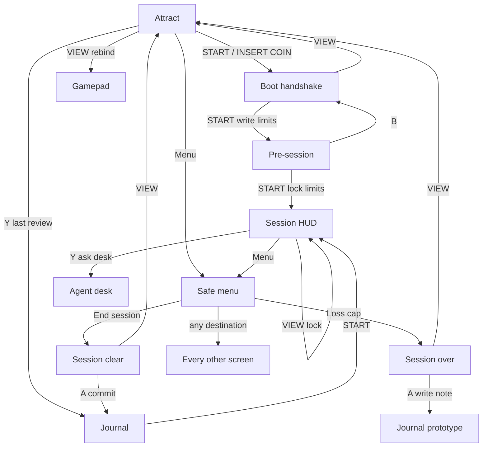

# How to play an evening

The cabinet is a **session**, not a gallery. Start on the attract screen. `START` (or click **INSERT COIN**) walks the evening in order. `Menu` (`M` on the keyboard) lists every screen so you can jump without breaking the order.

Nothing in the menu can fire an order. Opening it cancels an arm and locks new opens. Close (`X`) and panic flatten (`Y` on the live HUD) still work underneath.

## First run

1. Open the app in desktop Chrome.
2. Pair the 8BitDo in **X** (XInput) with the 2.4G dongle, or use USB-C.
3. Focus the tab and **press any button** — the Gamepad API stays silent until that gesture.
4. On attract: `START` or click **INSERT COIN**.
5. On boot: tap `LT`, `RT`, `A`, `B`, `X`, `Y` once each (optional). `START` writes limits even if the handshake is short.
6. On pre-session: read the limits, tick readiness if you want (it never blocks), write tonight's plan. `START` locks limits and opens the session HUD.

To talk to a real demo account, open **Live HUD** from the menu, paste the memory-only WebSocket token, and connect. Prices and fills need the Python gateway. The designed session HUD is playable without it.

## In session

Two hands, every fire:

| Input | Action |
|---|---|
| `LT` (hold) | Clutch — nothing opens without it |
| `A` | Arm **BUY** |
| `B` | Arm **SELL** / cancel an arm (counts as a stand-down when a condition is live) |
| `RT` | Confirm to fire |
| D-pad | Symbol / lot size |
| `LB` / `RB` | Timeframe |
| `X` | Close the active position |
| `Y` | Flatten (panic) on the **live** HUD; ask the desk on the designed HUD |
| `VIEW` | Lock / unlock the session |
| `Menu` / `START` | Open the safe menu |

The tab must stay focused. Hiding it or unplugging the pad cancels an arm and locks new opens. Flatten and Close still work.

## Close and review

1. Open the menu and choose **End session** (tally) or **Loss cap** (the cap did its job).
2. On session clear, `A` commits the evening into the journal. The tally cannot be edited after that.
3. From the journal, open a trade's tape (**Replay**). The left stick scrubs; `B` returns. Replay cannot send an order: mounting it unmounts the live HUD's agent and socket.
4. **Deck** is process-first. Outcome (money) is behind an explicit click.
5. **Process score** is five axes. Standing down on a dead tape scores 100. A skipped checklist item shrinks the denominator; it does not score zero.

## Controller {#controller}

Physical **Start** and **Menu** are the same Xbox button (index 9). The screen decides what it does: Start on attract/boot/pre, Menu everywhere else.

Keyboard fallback (ignored while a text field is focused):

| Key | Same as |
|---|---|
| `Enter` / `Space` | Start |
| `Esc` / `Backspace` | B (back / close menu) |
| `M` | Menu |
| `V` | View |
| `Y` | Y |
| `A` | A |
| Arrows | D-pad (menu cursor) |

## Every screen {#screens}

Open **Menu** from attract (or anywhere). Groups:

**Play** — Session HUD, Live HUD (gateway), Agent desk, Deck, Size calculator, Trade detail

**Review** — Journal, Replay, History, Process score, Reports

**Close** — End session, Loss cap

**Setup** — Gamepad, Settings, System, Data, Philosophy

**Cabinet** — Attract, Boot, Pre-session

**Art / Gallery** — matrix and city skins, plus the fixed-data prototype of journal / replay / report / settings

The left rail still warps to any artboard, including the six session HUD states (safe, armed, unknown, stale, close-only, locked). That is design review, not the evening path.

## Safety you cannot turn off

- Demo only. A live host or live account refuses to boot.
- The gateway is the only component allowed to approve an order.
- The AI desk is read-only. It cannot fire.
- Tilt may slow a new open. It never blocks close or panic.
- Overlay navigation cannot emit `intent.open` or `intent.modify`.
